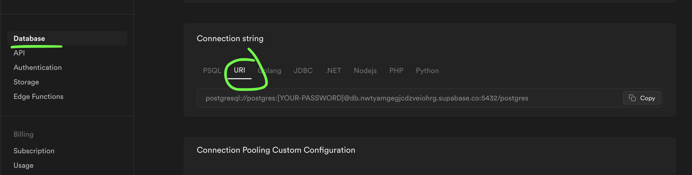
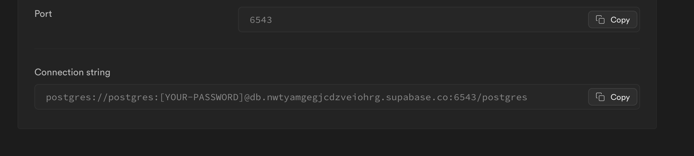

## Nextjs: Server Actions
Este repositorio contiene el código del proyecto usado en el curso de Server Actions:

[](https://youtu.be/1hstTQypAKo)

## Instalación
Como primer paso, es necesario instalar las dependeicias, por lo tanto, ejecuta el siguiente comando:

```bash
npm install
```

## Inicialización de la base de datos
Para este proyecto he usado Supabase para crear una base de datos Postgres. Puedes usar cualquier otro proveedor o incluso correr el proyecto desde tu ambiente local.

Lo que nos interesa es obtener la URL de conexión, una vez que la tengas hay que crear el archivo `.env` en el directorio del proyecto y le agregaremos las siguientes variables de entorno:

```bash
DATABASE_URL="postgres://<user>:<password>@db.asdfghjkl.supabase.co:6543/postgres?pgbouncer=true"
DIRECT_URL="postgresql://<user>:<password>@db.asdfghjkl.supabase.co:5432/postgres"
```

Para entornos serverless como NextJs y Vercel, es importante usar PgBouncer para evitar picos de conexiones a la base de datos. Éstos se originan porque en un entorno serverless, las funciones tienen un tiempo corto de vida y cada una de ellas crean una conexión cuando se ejecutan.

En Supabase puedes obtener la URL de la base de datos de la siguiente manera:



Y la conexión con PgBouncer se encuentra en la sección **Connection Pooling Custom Configuration**



Si tu base de datos no soporta conexiones con PG Bouncer, solo usa `DATABASE_URL`:

```bash
DATABASE_URL="postgresql://<user>:<password>@db.asdfghjkl.supabase.co:5432/postgres"
```

Para inicializar la base de dato ejecutaremos:

```bash
npx prisma migrate deploy
```

## Correr el servidor de desarrollo
Ahora ya podemos correr Nextjs de manera local:

```bash
npm run dev
```

## Directorio del proyecto
- `components`: Componentes UI del proyecto
- `components/ui`: Componentes UI generados con Shadcn UI
- `prisma`: Configuración de prisma, que incluye el esquema de la base de datos, los modelos, y las migraciones con SQL
- `lib`: Funciones de utilidad del proyecto
- `lib/products.ts`: Funciones para interactuar con la base de datos
- `lib/schema.ts`: Esquema de validación de los datos
- `lib/serverActions.ts`: Abstracción de las funciones de Nextjs para crear Server Actions

Esta abstracción nos permite crear **server actions** de manera sencilla, sin tener que preocuparnos por el manejo de errores, validación de datos, etc.
Solo necesitamos definir el esquema de validación, y la función que se ejecutará cuando se llame al server action.

```typescript
export const saveProductAction = createServerAction({
  inputSchema: ProductSchema,
  handler: saveProduct,
});
```

De esta manera obtenemos un server action que podemos usar en cualquier parte de nuestra aplicación que tiene tipado y validación de datos.

# Nextjs Pro 😎💪
Domina Server Actions y NextJs como todo un profesional. Así como todos los tips avanzados de Aprendo!

[](https://yovanyluis.gumroad.com/l/nextjs-avanzado)

